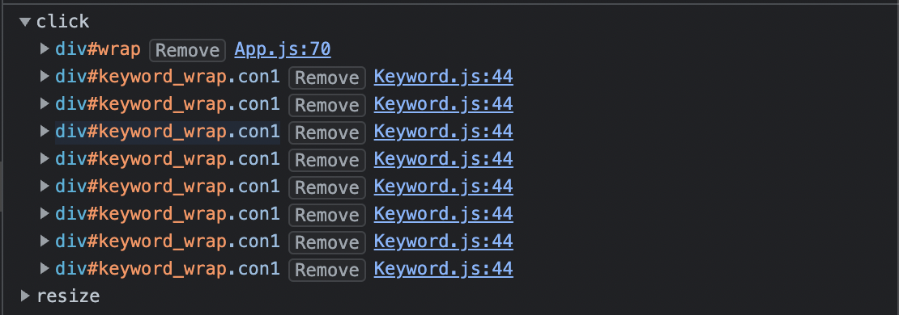

# <b>Big Kids</b>

## <b>Outline</b>

"어린이들을 위한 뉴스"를 제공하는 웹사이트 입니다.

그래프, 워드클라우드 통해 오늘의 뉴스를 한눈에 볼 수 있습니다.

<strong><a target="_blank" href="https://bigkids.co.kr">https://bigkids.co.kr</a></strong>

<br>

## <b>Period</b>

22.06.12 - 22.07.14

<br>

## <b>Tools</b>

      

<br>

## <b>Role</b>

\- 차트놀이 페이지 개발 ( 메인페이지 )

\- 서버 데이터 시각화 ( D3, chart )

\- 웹 PDF 다운로드

\- 반응형 웹

<br>

## <b>Description</b>

<br>

### <b>1. Vanilla JS 컴포넌트</b>

<br>

단순한 사이트라 관리해야 할 상태가 거의 없지만,

날짜에 따라 데이터를 서버로부터 불러와 오늘의 키워드, 그래프, 테이블 등

화면의 주요 요소들을 다시 렌더링 해야하기 때문에,

프로젝트 초기 단순히 요청후 렌더링 함수를 호출하는 방식에 어려움을 느껴

좀 더 체계적으로 관리하기 위해 바뀌는 요소들을 컴포넌트화 하였습니다.

<small><i>"개발자 황준일 Vanilla Javascript로 웹 컴포넌트 만들기"</i>를 참고했습니다.</small>

```javascript
export default class Component {
  target; // 컴포넌트가 마운트 될 DOM입니다.
  state;
  props; // 부모컴포넌트의 상태, 메서드를 넘겨받을 수 있습니다.

  constructor(target, props) {
    this.target = target;
    this.props = props;
    this.setup();
    this.render();
    this.setEvent();
  }

  setup() {}
  // 컴포넌트의 초기 상태를 설정하는 함수입니다.

  setEvent() {}
  // 컴포넌트에 이벤트를 등록하는 함수입니다.
  // target에만 이벤트 리스너를 추가하고
  // 나머지는 주로 이벤트 버블링을 통해 처리합니다.

  mounted() {}
  // 컴포넌트가 DOM에 마운트 된 후 실행되는 함수입니다.
  // DOM에 마운트 된 이후 그래프를 렌더링 할때 사용하였습니다.

  template() {
    return ``;
  }
  // 템플릿으로 사용할 문자열을 반환하는 함수입니다.

  render() {
    const template = this.tempate();
    if (template) {
      this.target.innerHTML = template;
      this.mounted();
    }
  }
  // 컴포넌트를 화면에 렌더링하는 함수입니다.
  // 'innerHTML'로 요소를 변경합니다.
  // 렌더링할 DOM이 있을때만 렌더링 합니다.

  setState(newState) {
    this.state = {
      ...this.state,
      ...newState,
    };
    this.render();
  }
  // 컴포넌트의 상태를 변경하는 함수입니다.
  // 컴포넌트의 상태는 이 메서드를 사용해서만 변경합니다.
  // 상태가 변경후 render함수를 호출해 상태에 따른 리렌더링이 자동화됩니다.
  // 렌더링이 필요할때 상태만 변경하면 되기때문에,
  // 데이터가 없는 경우의 UI, Loading UI등을 매우 편리하게 다룰 수 있었습니다.
}
```

컴포넌트를 추상화하여 컴포넌트 사용법을 강제할 수있으며

가독성, 디버깅, 기능추가 등 전반적인 개발이 매우 편리해졌습니다.

실제 컴포넌트를 생성할때는 위의 추상화한 컴포넌트로부터 상속을 받아 생성합니다.

최상위 컴포넌트인 App에서만 상태를 갖으며,

자식 컴포넌트에 상태 및 상태를 변경하는 함수를 전달하는 방식으로 사용했습니다.

<br>

### <b>2. API 호출</b>

<br>

```javascript
const cache = {};

async function request(url) {
  if (cache[url]) {
    return cache[url];
  }

  const res = await fetchWithTimeout(url, TIME_OUT);

  if (res.ok) {
    const json = await res.json();
    cache[url] = json;
    return json;
  }

  throw new Error(alert(MESSAGE));
}

async function fetchWithTimeout(url, options = {}) {
  const { timeout } = options;
  const abortController = new AbortController();
  const id = setTimeout(() => abortController.abort(), timeout);
  const response = await fetch(url, {
    ...options,
    signal: abortController.signal,
  });
  clearTimeout(id);
  return response;
}

export async function fetchBigKidsData(date) {
  return request(`${API_SERVER}/${date}`);
}
```

받아오는 데이터들이 고정적 이라고 판단하여

`{ URL : Response }` 형태의 Cache를 추가해

중복되는 데이터 요청을 줄이고 성능을 향상시켰습니다.

<br>

timeout을 설정하여 시간 이내 데이터 로드가 완료되지 않을 경우

사용자에게 실패를 따른 조치를 취할것을 알립니다.

\*---- timeout 원리 추가하기 ----\*

<br>

### <b>3. D3.js Word Cloud, Network Graph</b>

<br>

### <b>4. jsPDF, html2canvas </b>

<br>

### <b>+ 이벤트리스너 버그</b>

<br>



<br>

이벤트를 등록할떄 

자식요소는 리렌더링 되지만 부모인 `target`은 그대로기 때문에 이벤트 리스너가 중첩되는 현상이 발생했습니다.

중첩 문제를 해결하기 위해 `target`대신 마운트 된 이후 자식 노드에 이벤트를 등록할 수도 있지만

`onclick`을 사용해 해결했습니다.

`onclick`은 간편하게 이벤트를 등록할 수 있지만

한번에 하나의 핸들러만 연결할 수 있기때문에 좋은 해결책이 아닐 수 있습니다.

<br>

그럼에도 `onclick`을 사용한 이유는, 

자식노드에 이벤트 핸들러를 추가하려면 DOM 탐색을 한번 더 해야하고

클릭 외 다른 추가적인 이벤트가 필요하지 않은 상황이므로 

더 간편한 해결책인 `onclick`을 사용했습니다.

<br>

<!-- ### <b>+ setState 날짜 변경 버그 </b> -->
